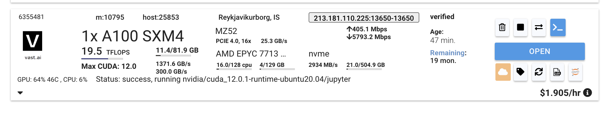

# vast.ai 环境




```
ssh -p 13650 root@213.181.110.225 -L 8080:localhost:8080
```


# fine tune

```
git clone https://github.com/xuwenhao/alpaca-lora.git

cd stanford_alpaca/

pip install -r requirements.txt

python3 finetune.py --base_model decapoda-research/llama-7b-hf --data_path yahma/alpaca-cleaned --output_dir ./lora-alpaca --batch_size 128 --micro_batch_size 64 --num_epochs 3 --learning_rate 1e-4 --cutoff_len 512 --val_set_size 2000 --lora_r 8 --lora_alpha 16 --lora_dropout 0.05 --lora_target_modules [q_proj,v_proj] --train_on_inputs --group_by_length
 
```

wandb: `https://wandb.ai/zhuguangbin86/alpaca_lora/runs/dwmq17ay/overview?workspace=user-zhuguangbin86`

## 遇到的问题：

1. bitsandbytes 库问题：

`AttributeError: /usr/local/lib/python3.8/dist-packages/bitsandbytes/libbitsandbytes_cpu.so: undefined symbol: cget_col_row_stats`


### 解决方案：

参考`https://github.com/TimDettmers/bitsandbytes/issues/156`

```
root@C.6355481:/usr/local/lib/python3.8/dist-packages/bitsandbytes$ mv libbitsandbytes_cpu.so libbitsandbytes_cpu.so.bak
root@C.6355481:/usr/local/lib/python3.8/dist-packages/bitsandbytes$ cp libbitsandbytes_cuda120.so libbitsandbytes_cpu.so
```


# serve

官方权重：

```
python3 generate.py \
    --load_8bit \
    --base_model 'decapoda-research/llama-7b-hf' \
    --lora_weights 'tloen/alpaca-lora-7b'
    --share_gradio
```

gradio url: `https://0b6ee261ab21b1f52b.gradio.live/`


重新fine tune后的权重：

```
python3 generate.py \
    --load_8bit \
    --base_model 'decapoda-research/llama-7b-hf' \
    --lora_weights './lora-alpaca'
    --share_gradio
```


gradio url: `https://2dee3fb9ece43978a3.gradio.live/`