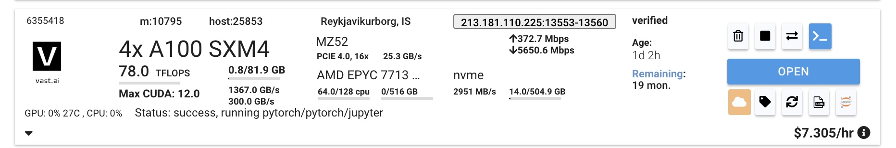

# vast.ai 环境





`ssh -p 13553 root@213.181.110.225 -L 8080:localhost:8080`

```
root@C.6355418:~$ nvidia-smi
Tue Jun  6 04:45:25 2023
+-----------------------------------------------------------------------------+
| NVIDIA-SMI 525.105.17   Driver Version: 525.105.17   CUDA Version: 12.0     |
|-------------------------------+----------------------+----------------------+
| GPU  Name        Persistence-M| Bus-Id        Disp.A | Volatile Uncorr. ECC |
| Fan  Temp  Perf  Pwr:Usage/Cap|         Memory-Usage | GPU-Util  Compute M. |
|                               |                      |               MIG M. |
|===============================+======================+======================|
|   0  NVIDIA A100-SXM...  On   | 00000000:9B:00.0 Off |                    0 |
| N/A   26C    P0    60W / 400W |      0MiB / 81920MiB |      0%      Default |
|                               |                      |             Disabled |
+-------------------------------+----------------------+----------------------+
|   1  NVIDIA A100-SXM...  On   | 00000000:A1:00.0 Off |                    0 |
| N/A   28C    P0    61W / 400W |      0MiB / 81920MiB |      0%      Default |
|                               |                      |             Disabled |
+-------------------------------+----------------------+----------------------+
|   2  NVIDIA A100-SXM...  On   | 00000000:DB:00.0 Off |                    0 |
| N/A   28C    P0    60W / 400W |      0MiB / 81920MiB |      0%      Default |
|                               |                      |             Disabled |
+-------------------------------+----------------------+----------------------+
|   3  NVIDIA A100-SXM...  On   | 00000000:E0:00.0 Off |                    0 |
| N/A   26C    P0    59W / 400W |      0MiB / 81920MiB |      0%      Default |
|                               |                      |             Disabled |
+-------------------------------+----------------------+----------------------+

+-----------------------------------------------------------------------------+
| Processes:                                                                  |
|  GPU   GI   CI        PID   Type   Process name                  GPU Memory |
|        ID   ID                                                   Usage      |
|=============================================================================|
|  No running processes found                                                 |
+-----------------------------------------------------------------------------+
root@C.6355418:~$

root@C.6355418:~$ python -V
Python 3.10.11

root@C.6355418:~$ git clone https://github.com/lm-sys/FastChat
root@C.6355418:~/FastChat$ pip3 install --upgrade pip  # enable PEP 660 support
Requirement already satisfied: pip in /opt/conda/lib/python3.10/site-packages (23.0.1)
Collecting pip
  Downloading pip-23.1.2-py3-none-any.whl (2.1 MB)
     ━━━━━━━━━━━━━━━━━━━━━━━━━━━━━━━━━━━━━━━━ 2.1/2.1 MB 8.5 MB/s eta 0:00:00
Installing collected packages: pip
  Attempting uninstall: pip
    Found existing installation: pip 23.0.1
    Uninstalling pip-23.0.1:
      Successfully uninstalled pip-23.0.1
Successfully installed pip-23.1.2
WARNING: Running pip as the 'root' user can result in broken permissions and conflicting behaviour with the system package manager. It is recommended to use a virtual environment instead: https://pip.pypa.io/warnings/venv
root@C.6355418:~/FastChat$ pip3 install -e .

```

# Model Weights

```
root@C.6355418:~/FastChat$ python3 -m fastchat.model.apply_delta --base huggyllama/llama-7b --target ./vicuna-7b --delta lmsys/vicuna-7b-delta-v1.1
Loading the delta weights from lmsys/vicuna-7b-delta-v1.1
Downloading (…)okenizer_config.json: 100%|████████████████████████████████████████████████████████████████████| 727/727 [00:00<00:00, 3.34MB/s]
Downloading tokenizer.model: 100%|██████████████████████████████████████████████████████████████████████████| 500k/500k [00:00<00:00, 3.25MB/s]
Downloading (…)cial_tokens_map.json: 100%|████████████████████████████████████████████████████████████████████| 411/411 [00:00<00:00, 2.29MB/s]
Downloading (…)lve/main/config.json: 100%|████████████████████████████████████████████████████████████████████| 610/610 [00:00<00:00, 3.50MB/s]
Downloading (…)model.bin.index.json: 100%|████████████████████████████████████████████████████████████████| 26.8k/26.8k [00:00<00:00, 3.41MB/s]
Downloading (…)l-00001-of-00002.bin: 100%|████████████████████████████████████████████████████████████████| 9.98G/9.98G [02:04<00:00, 80.1MB/s]
Downloading (…)l-00002-of-00002.bin: 100%|████████████████████████████████████████████████████████████████| 3.50G/3.50G [00:43<00:00, 80.2MB/s]
Downloading shards: 100%|████████████████████████████████████████████████████████████████████████████████████████| 2/2 [02:48<00:00, 84.28s/it]
Loading checkpoint shards: 100%|█████████████████████████████████████████████████████████████████████████████████| 2/2 [00:04<00:00,  2.17s/it]
Downloading (…)neration_config.json: 100%|█████████████████████████████████████████████████████████████████████| 137/137 [00:00<00:00, 748kB/s]
Loading the base model from huggyllama/llama-7b
Downloading (…)lve/main/config.json: 100%|████████████████████████████████████████████████████████████████████| 594/594 [00:00<00:00, 3.41MB/s]
Downloading (…)model.bin.index.json: 100%|████████████████████████████████████████████████████████████████| 26.8k/26.8k [00:00<00:00, 3.40MB/s]
Downloading (…)l-00001-of-00002.bin: 100%|████████████████████████████████████████████████████████████████| 9.98G/9.98G [02:04<00:00, 80.4MB/s]
Downloading (…)l-00002-of-00002.bin: 100%|████████████████████████████████████████████████████████████████| 3.50G/3.50G [00:43<00:00, 80.6MB/s]
Downloading shards: 100%|████████████████████████████████████████████████████████████████████████████████████████| 2/2 [02:47<00:00, 83.92s/it]
Loading checkpoint shards: 100%|█████████████████████████████████████████████████████████████████████████████████| 2/2 [00:04<00:00,  2.23s/it]
Downloading (…)neration_config.json: 100%|█████████████████████████████████████████████████████████████████████| 137/137 [00:00<00:00, 738kB/s]
Applying the delta
Applying delta: 100%|████████████████████████████████████████████████████████████████████████████████████████| 323/323 [00:09<00:00, 35.48it/s]
Saving the target model to ./vicuna-7b
root@C.6355418:~/FastChat$ ls -l vicuna-7b/
total 13161624
-rw-r--r-- 1 root root        575 Jun  6 04:59 config.json
-rw-r--r-- 1 root root        132 Jun  6 04:59 generation_config.json
-rw-r--r-- 1 root root 9976634558 Jun  6 04:59 pytorch_model-00001-of-00002.bin
-rw-r--r-- 1 root root 3500315539 Jun  6 04:59 pytorch_model-00002-of-00002.bin
-rw-r--r-- 1 root root      26788 Jun  6 04:59 pytorch_model.bin.index.json
-rw-r--r-- 1 root root        411 Jun  6 04:59 special_tokens_map.json
-rw-r--r-- 1 root root     499723 Jun  6 04:59 tokenizer.model
-rw-r--r-- 1 root root        727 Jun  6 04:59 tokenizer_config.json
root@C.6355418:~/FastChat$
```

# Inference with Command Line

```
root@C.6355418:~/FastChat$ python3 -m fastchat.serve.cli --model-path ./vicuna-7b --num-gpus 4
Loading checkpoint shards: 100%|█████████████████████████████████████████████████████████████████████████████████| 2/2 [00:11<00:00,  5.57s/it]
USER: zhuguangbin
ASSISTANT: Zhuguangbin refers to the Chinese name for the planet Jupiter.
USER: Tell me about the president of Mexico in 2019.
ASSISTANT: In 2019, the President of Mexico was Andrés Manuel López Obrador, also known as AMLO. He was elected in the July 2018 presidential election and took office on December 1, 2018.
USER: Tell me about the king of France in 2019.
ASSISTANT: In 2019, the King of France was King Charles X. He was the head of state of France and had been in power since 2007. Charles X was the great-great-great-grandson of King Charles X of France and was known for his conservative views and his support of the traditional monarchy.
USER: List all Canadian provinces in alphabetical order.
ASSISTANT: The Canadian provinces are:

1. Alberta
2. British Columbia
3. Manitoba
4. New Brunswick
5. Newfoundland and Labrador
6. Nova Scotia
7. Ontario
8. Prince Edward Island
9. Quebec
10. Saskatchewan
11. Yukon
12. Northwest Territories
13. Nunavut
USER: Write a Python program that prints the first 10 Fibonacci numbers.
ASSISTANT: Here is a Python program that prints the first 10 Fibonacci numbers:

def fibonacci(n):
  if n <= 1:
    return n
  else:
    return fibonacci(n-1) + fibonacci(n-2)

for i in range(1, 11):
  print(fibonacci(i))
  
This program defines a function called `fibonacci` that takes an integer `n` as an argument and returns the `n`th Fibonacci number. The function uses a recursive approach to calculate the Fibonacci numbers by calling itself with the previous two numbers as arguments. The program then loops through the first 10 Fibonacci numbers and prints them using the `fibonacci` function.
USER:  请列出中国历代王朝以及起止年份
ASSISTANT: ╭─────────────────────────────── Traceback (most recent call last) ────────────────────────────────╮
│ /opt/conda/lib/python3.10/runpy.py:196 in _run_module_as_main                                    │
│                                                                                                  │
│   193 │   main_globals = sys.modules["__main__"].__dict__                                        │
│   194 │   if alter_argv:                                                                         │
│   195 │   │   sys.argv[0] = mod_spec.origin                                                      │
│ ❱ 196 │   return _run_code(code, main_globals, None,                                             │
│   197 │   │   │   │   │    "__main__", mod_spec)                                                 │
│   198                                                                                            │
│   199 def run_module(mod_name, init_globals=None,                                                │
│
```

看来不支持中文

# Fine Tune


训练数据集：`https://huggingface.co/datasets/anon8231489123/ShareGPT_Vicuna_unfiltered`

下载后SCP到服务器：
```
$ scp -P 13553 ShareGPT_V3_unfiltered_cleaned_split_no_imsorry.json root@213.181.110.225:~/
Welcome to vast.ai. If authentication fails, try again after a few seconds, and double check your ssh key.
Have fun!
ShareGPT_V3_unfiltered_cleaned_split_no_imsorry.json                                                         100%  639MB   3.4MB/s   03:10
```

```
$ ssh -p 13553 root@213.181.110.225 -L 8080:localhost:8080

root@C.6355418:~$ ls -l
total 654808
drwxr-xr-x 14 root root      4096 Jun  6 04:59 FastChat
-rw-r--r--  1 root root 670505514 Jun  6 05:12 ShareGPT_V3_unfiltered_cleaned_split_no_imsorry.json
-rw-r--r--  1 root root      3879 Jun  5 02:37 Untitled.ipynb
drwxr-xr-x  6 root root      4096 Jun  5 02:37 alpaca-lora
-rw-r--r--  1 root root        18 Jun  5 02:32 onstart.sh
root@C.6355418:~$ 


torchrun --nproc_per_node=4 --master_port=20001 fastchat/train/train_mem.py \
    --model_name_or_path huggyllama/llama-7b  \
    --data_path ~/ShareGPT_V3_unfiltered_cleaned_split_no_imsorry.json \
    --bf16 True \
    --output_dir ./vicuna-7b-finetuned \
    --num_train_epochs 3 \
    --per_device_train_batch_size 128 \
    --per_device_eval_batch_size 128 \
    --gradient_accumulation_steps 16 \
    --evaluation_strategy "no" \
    --save_strategy "steps" \
    --save_steps 1200 \
    --save_total_limit 10 \
    --learning_rate 2e-5 \
    --weight_decay 0. \
    --warmup_ratio 0.03 \
    --lr_scheduler_type "cosine" \
    --logging_steps 1 \
    --fsdp "full_shard auto_wrap" \
    --fsdp_transformer_layer_cls_to_wrap 'LlamaDecoderLayer' \
    --tf32 True \
    --model_max_length 2048 \
    --gradient_checkpointing True \
    --lazy_preprocess True
```


报错：`ModuleNotFoundError: No module named 'einops'` `ModuleNotFoundError: No module named 'torch'`

参考之前用skypilot的脚本：

```
root@C.6355418:~$ conda create -n vicuna python=3.10 -y
(base) root@C.6355418:~$ conda activate vicuna
(vicuna) root@C.6355418:~$

(vicuna) root@C.6355418:~$ pip install torch==1.13.1+cu116 torchvision==0.14.1+cu116 torchaudio==0.13.1 --extra-index-url https://download.pytorch.org/whl/cu116

# Install huggingface with the LLaMA commit
(vicuna) root@C.6355418:~$ git clone https://github.com/huggingface/transformers.git
fatal: destination path 'transformers' already exists and is not an empty directory.
(vicuna) root@C.6355418:~$ cd transformers
(vicuna) root@C.6355418:~/transformers$ git checkout 41a2f3529c6b56866c317031375ffd3e7b8bea01
HEAD is now at 41a2f3529 Fix OPTForQuestionAnswering doc string (#22481)
(vicuna) root@C.6355418:~/transformers$ pip install .

# Install fastchat
(vicuna) root@C.6355418:~$ cd ~/FastChat/
(vicuna) root@C.6355418:~/FastChat$ pip install -e .

```

重新运行，仍然报错 `ModuleNotFoundError: No module named 'einops'` `ModuleNotFoundError: No module named 'torch'`


查了下是用flash_attn的问题，指定版本重新安装`pip install flash_attn==1.0.5`，结果报错：
```
RuntimeError: flash_attn was requested, but nvcc was not found.  Are you sure your environment has nvcc available?  If you're installing within a container from https://hub.docker.com/r/pytorch/pytorch, only images whose names contain 'devel' will provide nvcc.
```

```
(vicuna) root@C.6355418:~$ apt-get install build-essential
(vicuna) root@C.6355418:~$ wget https://developer.download.nvidia.com/compute/cuda/11.1.1/local_installers/cuda_11.1.1_455.32.00_linux.run
(vicuna) root@C.6355418:~$ sudo sh cuda_11.1.1_455.32.00_linux.run

root@7d5460f661e1:~# cat /etc/profile.d/cuda.sh
export PATH=/usr/local/cuda/bin:$PATH
export LD_LIBRARY_PATH=/usr/local/cuda/lib64:$LD_LIBRARY_PATH

root@7d5460f661e1:~# nvcc --version
nvcc: NVIDIA (R) Cuda compiler driver
Copyright (c) 2005-2020 NVIDIA Corporation
Built on Mon_Oct_12_20:09:46_PDT_2020
Cuda compilation tools, release 11.1, V11.1.105
Build cuda_11.1.TC455_06.29190527_0

root@7d5460f661e1:~# pip install flash_attn==1.0.5

```
这次安装成功了。

```
torchrun --nproc_per_node=4 --master_port=20001 fastchat/train/train_mem.py \
    --model_name_or_path huggyllama/llama-7b  \
    --data_path ~/ShareGPT_V3_unfiltered_cleaned_split_no_imsorry.json \
    --bf16 True \
    --output_dir ./vicuna-7b-finetuned \
    --num_train_epochs 3 \
    --per_device_train_batch_size 128 \
    --per_device_eval_batch_size 128 \
    --gradient_accumulation_steps 16 \
    --evaluation_strategy "no" \
    --save_strategy "steps" \
    --save_steps 1200 \
    --save_total_limit 10 \
    --learning_rate 2e-5 \
    --weight_decay 0. \
    --warmup_ratio 0.03 \
    --lr_scheduler_type "cosine" \
    --logging_steps 1 \
    --fsdp "full_shard auto_wrap" \
    --fsdp_transformer_layer_cls_to_wrap 'LlamaDecoderLayer' \
    --tf32 True \
    --model_max_length 2048 \
    --gradient_checkpointing True \
    --lazy_preprocess True
```


报错：
```
Token indices sequence length is longer than the specified maximum sequence length for this model (79595 > 2048). Running this sequence through the model will result in indexing errors
```

因为训练样本中数据token偏大，调整per_device_train_batch_size/per_device_eval_batch_size/model_max_length:

```
torchrun --nproc_per_node=4 --master_port=20001 fastchat/train/train_mem.py \
    --model_name_or_path huggyllama/llama-7b  \
    --data_path ~/ShareGPT_V3_unfiltered_cleaned_split_no_imsorry.json \
    --bf16 True \
    --output_dir ./vicuna-7b-finetuned \
    --num_train_epochs 3 \
    --per_device_train_batch_size 10 \
    --per_device_eval_batch_size 10 \
    --gradient_accumulation_steps 16 \
    --evaluation_strategy "no" \
    --save_strategy "steps" \
    --save_steps 1200 \
    --save_total_limit 10 \
    --learning_rate 2e-5 \
    --weight_decay 0. \
    --warmup_ratio 0.03 \
    --lr_scheduler_type "cosine" \
    --logging_steps 1 \
    --fsdp "full_shard auto_wrap" \
    --fsdp_transformer_layer_cls_to_wrap 'LlamaDecoderLayer' \
    --tf32 True \
    --model_max_length 204800 \
    --gradient_checkpointing True \
    --lazy_preprocess True
```

CUDA OOM: 
```
OutOfMemoryError: CUDA out of memory. Tried to allocate 31.25 GiB (GPU 2; 79.15 GiB total capacity; 54.11 GiB already allocated; 22.95 GiB
free; 54.66 GiB reserved in total by PyTorch) If reserved memory is >> allocated memory try setting max_split_size_mb to avoid fragmentation.
See documentation for Memory Management and PYTORCH_CUDA_ALLOC_CONF
```

开启cpu offload：
```
torchrun --nproc_per_node=4 --master_port=20001 fastchat/train/train_mem.py \
    --model_name_or_path huggyllama/llama-7b  \
    --data_path ~/ShareGPT_V3_unfiltered_cleaned_split_no_imsorry.json \
    --bf16 True \
    --output_dir ./vicuna-7b-finetuned \
    --num_train_epochs 3 \
    --per_device_train_batch_size 10 \
    --per_device_eval_batch_size 10 \
    --gradient_accumulation_steps 16 \
    --evaluation_strategy "no" \
    --save_strategy "steps" \
    --save_steps 1200 \
    --save_total_limit 10 \
    --learning_rate 2e-5 \
    --weight_decay 0. \
    --warmup_ratio 0.03 \
    --lr_scheduler_type "cosine" \
    --logging_steps 1 \
    --fsdp "full_shard auto_wrap offload" \
    --fsdp_transformer_layer_cls_to_wrap 'LlamaDecoderLayer' \
    --tf32 True \
    --model_max_length 204800 \
    --gradient_checkpointing True \
    --lazy_preprocess True
```

无效，继续降低batch_size：

```
torchrun --nproc_per_node=4 --master_port=20001 fastchat/train/train_mem.py \
    --model_name_or_path huggyllama/llama-7b  \
    --data_path ~/ShareGPT_V3_unfiltered_cleaned_split_no_imsorry.json \
    --bf16 True \
    --output_dir ./vicuna-7b-finetuned \
    --num_train_epochs 3 \
    --per_device_train_batch_size 2 \
    --per_device_eval_batch_size 2 \
    --gradient_accumulation_steps 16 \
    --evaluation_strategy "no" \
    --save_strategy "steps" \
    --save_steps 1200 \
    --save_total_limit 10 \
    --learning_rate 2e-5 \
    --weight_decay 0. \
    --warmup_ratio 0.03 \
    --lr_scheduler_type "cosine" \
    --logging_steps 1 \
    --fsdp "full_shard auto_wrap offload" \
    --fsdp_transformer_layer_cls_to_wrap 'LlamaDecoderLayer' \
    --tf32 True \
    --model_max_length 204800 \
    --gradient_checkpointing True \
    --lazy_preprocess True
```

仍然CUDA OOM，根据`https://github.com/pytorch/pytorch/issues/98823`，调整：

